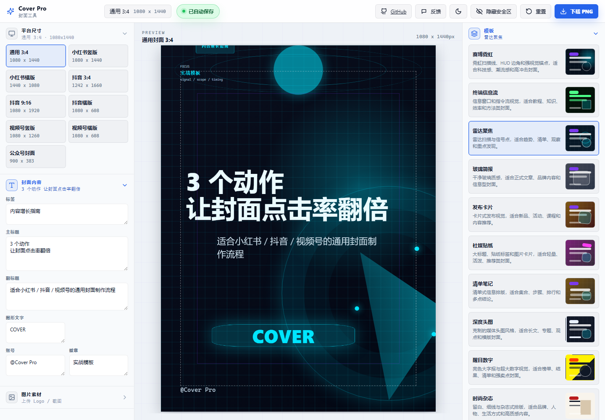
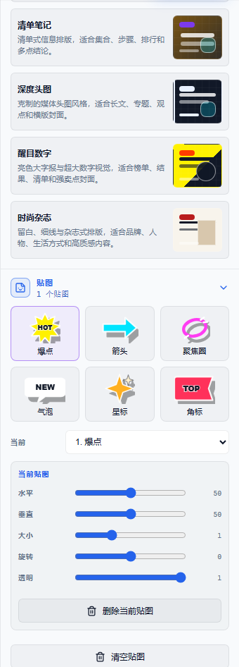
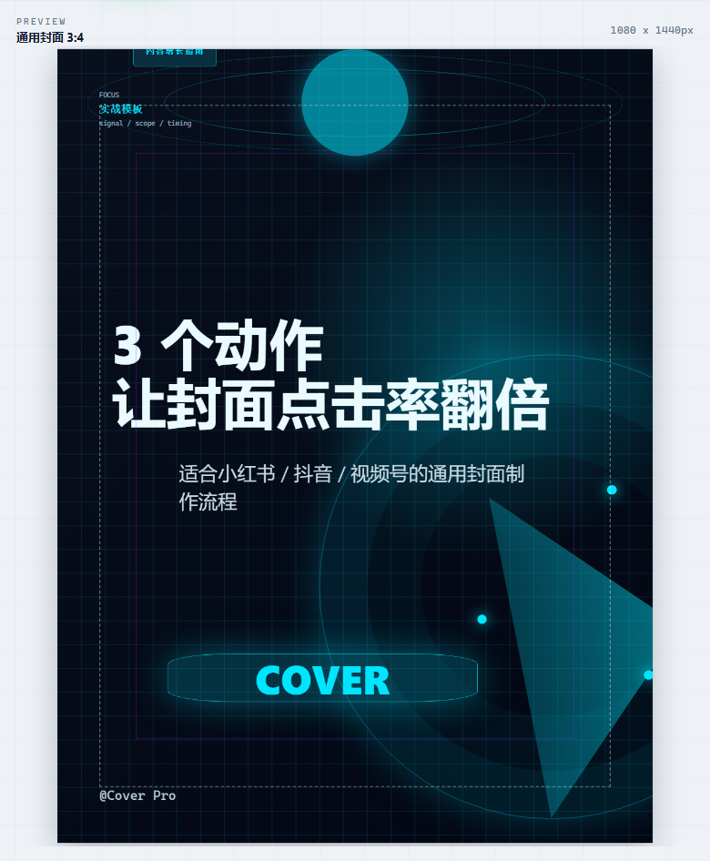

# Cover Pro

Cover Pro 是一个基于 React、TypeScript 和 Vite 的封面制作工具，用来快速生成小红书、抖音、视频号、微信公众号等平台常用封面图。项目是纯前端静态应用，核心能力包括尺寸预设、封面模板、实时画布预览、文字编辑、图片上传、贴图装饰、主题配色、草稿保存和 PNG 导出。



## 功能简介

- 多平台尺寸：内置通用 3:4、小红书竖版/横版、抖音竖版 3:4、抖音竖版 9:16、抖音横版、视频号竖版/横版、微信公众号封面。
- 多套模板：赛博霓虹、终端信息流、雷达聚焦、玻璃简报、发布卡片、社媒贴纸、清单笔记、深度头图、醒目数字、时尚杂志。
- 内容编辑：支持编辑标签、主标题、副标题、图形文字、账号和徽章，文本框支持换行。
- 视觉设置：支持切换模板、主题色、自定义主色、自定义背景色、文本颜色、字体、字号、行高、字重、宽度和背景亮度。
- 实时预览：中间画布按当前平台尺寸比例缩放展示，编辑结果所见即所得。
- 元素定位：文字元素可在画布中拖动，也可以在右侧「元素位置」面板用 X/Y 滑杆精确调整。
- 图片素材：支持上传 Logo、截图、产品图等素材，并调整图片大小和位置。
- 内置贴图：提供爆点、箭头、聚焦圈、气泡、星标、角标，支持点击添加、拖拽定位、缩放、旋转、透明度调整和删除。
- 显示控制：可独立显示或隐藏标签、副标题、账号、徽章、图形文字、图片、贴图和安全区。
- 草稿保存：自动保存到浏览器本地存储，也支持 `Ctrl + S` 手动保存。
- PNG 导出：点击「下载 PNG」即可按当前平台尺寸导出封面图片。
- 反馈入口：顶部「反馈」按钮会打开 GitHub Issue，并自动带上当前尺寸、模板、主题、字体和浏览器信息。

## 界面截图

截图通过 Playwright 访问本地开发地址 `http://localhost:5173/` 生成，文件位于 `docs/screenshots/`。

### 工作台总览

左侧负责平台尺寸、封面内容和图片素材；中间是实时画布；右侧负责模板、贴图、主题、排版、元素位置和显示控制。


### 配置面板

右侧面板集中管理模板、贴图、主题、文本颜色、排版、元素位置、显示内容和装饰图片。



### 画布预览

画布会根据选择的平台尺寸缩放显示，导出时会按真实像素尺寸生成 PNG。



## 技术栈

- React 18
- TypeScript
- Vite 5
- html-to-image
- lucide-react
- Playwright，用于本地访问验证和截图

## 快速开始

### 环境要求

- Node.js 20 或更高版本。
- npm。项目已提交 `package-lock.json`，推荐使用 `npm ci` 获得更稳定的依赖安装结果。

### 安装依赖

```bash
npm install
```

CI 或干净环境建议使用：

```bash
npm ci
```

### 启动开发服务

```bash
npm run dev
```

默认访问地址：

```text
http://localhost:5173/
```

如果 5173 端口被占用，Vite 会自动选择其他端口，请以终端输出为准。

### 构建生产版本

```bash
npm run build
```

该命令会先执行 TypeScript 项目构建，再执行 Vite 生产构建。构建产物输出到：

```text
dist/
```

### 本地预览生产版本

```bash
npm run preview
```

预览服务用于检查 `dist/` 中的生产构建结果。

## 使用说明

### 1. 选择平台尺寸

左侧「平台尺寸」区域提供当前内置的输出尺寸。点击任意尺寸后，中间画布会切换为对应比例。

| 平台/用途 | 尺寸 |
| --- | --- |
| 通用封面 3:4 | 1080 x 1440 |
| 小红书视频封面竖版 | 1080 x 1440 |
| 小红书视频封面横版 | 1440 x 1080 |
| 抖音视频封面竖版 3:4 | 1242 x 1660 |
| 抖音视频封面竖版 9:16 | 1080 x 1920 |
| 抖音视频封面横版 | 1080 x 608 |
| 视频号视频封面竖版 | 1080 x 1260 |
| 视频号视频封面横版 | 1080 x 608 |
| 微信公众号封面 | 900 x 383 |

### 2. 填写封面内容

在左侧「封面内容」中填写：

- 标签：栏目名、分类或主题提示。
- 主标题：封面的核心视觉标题。
- 副标题：摘要、卖点、补充说明或清单内容。
- 图形文字：模板图形块中的强调文字。
- 账号：作者名、账号名或品牌名。
- 徽章：重点推荐、编号、活动标签等。

所有文本都会实时同步到画布。主标题和副标题支持换行，适合制作短视频封面和图文封面中的强标题排版。

### 3. 选择模板

右侧「模板」区域可以切换整体视觉风格。

| 模板 | 适合内容 |
| --- | --- |
| 赛博霓虹 | 科技、AI、工具、趋势、强视觉冲击封面 |
| 终端信息流 | 教程、效率、知识、方法论 |
| 雷达聚焦 | 趋势观察、清单、重点发现 |
| 玻璃简报 | 正式内容、品牌内容、信息型封面 |
| 发布卡片 | 新品、活动、课程、内容推荐 |
| 社媒贴纸 | 轻量、活泼、推荐类封面 |
| 清单笔记 | 步骤、排行、多点总结 |
| 深度头图 | 长文、专题、观点、横版头图 |
| 醒目数字 | 榜单、结果、数字卖点 |
| 时尚杂志 | 品牌、人物、生活方式、高质感内容 |

切换模板时，项目会重置部分排版参数和元素位置，使新模板保持相对合理的默认布局。

### 4. 设置主题和文字颜色

右侧「主题色」提供内置主题：

- Quantum Cyan
- Signal Green
- Magenta Pulse
- Warning Amber
- Cold White
- Red Alert
- Custom

选择 `Custom` 或修改自定义主色/背景色后，画布会立即使用自定义配色。右侧「文本颜色」可以分别设置标签、主标题、副标题、账号、徽章和图形文字的颜色；保持 `AUTO` 时会跟随当前模板和主题。

### 5. 上传图片素材

左侧「图片素材」支持上传 Logo、截图、产品图或人物图。上传后可在右侧「装饰与图片」区域调整：

- 图片大小。
- 水平位置。
- 垂直位置。
- 装饰密度。

图片素材和「图形文字」是两个独立元素。图片设置只影响上传图片，图形文字位置通过「元素位置」或画布拖动调整。

### 6. 添加和编辑贴图

右侧「贴图」面板内置 6 类贴图：

- 爆点。
- 箭头。
- 聚焦圈。
- 气泡。
- 星标。
- 角标。

可以点击贴图添加到画布，也可以从贴图库拖到画布指定位置。选中贴图后可调整水平位置、垂直位置、大小、旋转角度和透明度。贴图可通过删除按钮、`Delete` 或 `Backspace` 删除，「清空贴图」会移除当前封面上的全部贴图。

### 7. 调整排版

右侧「排版」区域提供标题和副标题的细节控制：

- 主标题字号、行高、字距、字重和宽度。
- 副标题字号、行高、上间距和宽度。
- 文本对齐方式。
- 字体风格。
- 自定义字体上传。
- 背景亮度。

字体选项包括系统字体、衬线、等宽、展示字体、圆体、窄体、手写、书法风格和自定义字体。

### 8. 拖拽和精确定位

画布中的标签、主标题、副标题、账号、徽章和图形文字可以直接拖动。右侧「元素位置」可选择单个元素，并通过 X/Y 滑杆做精确调整。

为了避免导出时找不到元素，拖拽时元素不会被完整拖出画布。

### 9. 控制显示内容

右侧「显示内容」可以独立控制以下元素的显示状态：

- 标签。
- 副标题。
- 账号。
- 徽章。
- 图形文字。
- 图片。
- 贴图。
- 安全区。

安全区用于辅助检查重要内容是否落在平台裁切范围内。导出前如不需要辅助线，可以点击顶部「隐藏安全区」或在面板中关闭安全区显示。

### 10. 保存和导出

Cover Pro 有两类保存行为：

- 草稿保存：自动保存编辑状态到浏览器本地存储，刷新页面后会尽量恢复上一次设计。也可以按 `Ctrl + S` 手动保存。
- PNG 导出：点击顶部「下载 PNG」，按当前平台尺寸生成图片文件。

草稿保存不会生成图片文件；最终封面需要通过「下载 PNG」导出。

## 顶部按钮

| 按钮 | 作用 |
| --- | --- |
| GitHub | 打开项目仓库 |
| 反馈 | 打开 GitHub Issue，并预填当前封面上下文 |
| 亮色/暗色 | 切换编辑器界面主题 |
| 隐藏/显示安全区 | 控制画布安全区辅助线 |
| 重置 | 重置当前内容和样式 |
| 下载 PNG | 导出当前封面 |

## 部署

### 静态部署

项目是静态前端应用，构建后只需要部署 `dist/` 目录。可部署到 GitHub Pages、Vercel、Netlify、Cloudflare Pages、Nginx 静态目录等环境。

通用流程：

```bash
npm ci
npm run build
```

然后发布：

```text
dist/
```

### GitHub Pages

仓库已包含 GitHub Pages 工作流：

```text
.github/workflows/deploy-pages.yml
.github/workflows/static.yml
```

推送到 `main` 分支或手动触发 workflow 后，GitHub Actions 会安装依赖、构建项目，并把 `dist/` 发布到 GitHub Pages。

首次使用 GitHub Pages 时，需要在仓库设置中启用：

```text
Settings -> Pages -> Build and deployment -> Source: GitHub Actions
```

部署完成后的访问地址通常是：

```text
https://<你的用户名>.github.io/<仓库名>/
```

### Vite base 路径

GitHub Pages 项目站点通常部署在仓库名子路径下，例如 `/cover-pro/`。项目在 `vite.config.ts` 中使用环境变量控制 base：

```ts
base: process.env.VITE_BASE_PATH ?? '/',
```

GitHub Actions 构建时会注入：

```text
VITE_BASE_PATH=/${{ github.event.repository.name }}/
```

因此本地开发仍使用 `/`，线上部署会自动使用 `/<仓库名>/`。

## 项目结构

```text
cover-pro/
  docs/
    screenshots/              # README 截图
  src/
    components/               # 画布、预览舞台等组件
    config/                   # 功能开关和外部链接
    data/                     # 平台尺寸、模板、主题、贴图、默认内容
    styles/                   # 全局样式和模板样式
      templates/              # 模板基础样式、布局和分模板样式
    templates/                # 封面模板组件
    utils/                    # 导出图片、颜色、文件名工具
  index.html
  package.json
  vite.config.ts
```

## 关键文件

| 文件 | 说明 |
| --- | --- |
| `src/App.tsx` | 主编辑器界面、状态管理、保存、导出、反馈、拖拽交互 |
| `src/components/CoverCanvas.tsx` | 真实封面画布，负责挂载模板、贴图、安全区和 CSS 变量 |
| `src/components/PreviewStage.tsx` | 画布缩放预览容器 |
| `src/data/platforms.ts` | 平台尺寸配置 |
| `src/data/templates.ts` | 模板元信息 |
| `src/data/themes.ts` | 主题色配置 |
| `src/data/stickers.ts` | 内置贴图配置 |
| `src/data/defaults.ts` | 默认内容和默认样式 |
| `src/utils/exportImage.ts` | PNG 导出逻辑 |
| `src/utils/filename.ts` | 导出文件名生成 |
| `src/config/features.ts` | GitHub 链接、反馈链接和调试开关 |
| `vite.config.ts` | Vite 配置、GitHub Pages base、模板布局写入接口 |

## 二次开发

### 新增平台尺寸

编辑：

```text
src/data/platforms.ts
```

新增一项：

```ts
{
  id: 'custom-cover',
  name: '自定义封面',
  shortName: '自定义',
  group: 'General',
  width: 1080,
  height: 1350,
}
```

新增后，左侧「平台尺寸」会自动出现该选项。

### 新增主题

编辑：

```text
src/data/themes.ts
```

主题结构：

```ts
{
  id: 'my-theme',
  name: 'My Theme',
  accent: '#00E5FF',
  accent2: '#7C5CFF',
  background: '#0B1020',
  foreground: '#EAFBFF',
  muted: '#8DA4BC',
}
```

### 新增模板

新增模板通常需要修改这些位置：

```text
src/types.ts
src/data/templates.ts
src/templates/
src/components/CoverCanvas.tsx
src/styles/templates/
```

推荐流程：

1. 在 `src/types.ts` 的 `TemplateId` 中补充模板 ID。
2. 在 `src/data/templates.ts` 中添加模板名称、描述和默认主题。
3. 在 `src/templates/` 下创建对应模板组件。
4. 在 `src/components/CoverCanvas.tsx` 中根据 `templateId` 挂载组件。
5. 在 `src/styles/templates/` 中添加模板样式，并从 `src/styles/templates/index.css` 引入。

### 调试模板默认布局

项目内置一个仅开发环境使用的模板布局写入接口。默认关闭：

```ts
// src/config/features.ts
export const coverToolFeatures = {
  enableTemplateLayoutDebug: false,
} as const;
```

需要调试模板默认位置时，把它临时改为 `true`，启动开发服务，然后在页面中拖动元素或调整「元素位置」，点击「调试：写入当前模板默认布局」。布局会写入：

```text
src/styles/templates/_layouts.css
```

完成后请把 `enableTemplateLayoutDebug` 改回 `false`。该功能会修改项目文件，只适合开发者调模板布局，不建议在生产环境启用。

## 反馈配置

顶部「反馈」按钮使用 `src/config/features.ts` 中的地址：

```ts
export const coverToolFeatures = {
  githubRepositoryUrl: 'https://github.com/suyupeng0101/cover-pro',
  feedbackIssueUrl: 'https://github.com/suyupeng0101/cover-pro/issues/new',
} as const;
```

如果需要更换反馈渠道，可以把 `feedbackIssueUrl` 改成飞书表单、腾讯问卷、金数据、Google Forms 或自建表单地址。

## 常见问题

### 下载 PNG 后没有文件怎么办？

先确认浏览器没有拦截下载，并等待画布渲染完成后再点击「下载 PNG」。如果仍然异常，重新启动开发服务后再试：

```bash
npm run dev
```

### 为什么保存后没有生成图片？

自动保存和 `Ctrl + S` 保存的是浏览器本地草稿，不会生成图片文件。生成图片需要点击「下载 PNG」。

### 刷新后为什么恢复了上一次内容？

项目会把草稿保存到浏览器 localStorage。需要恢复默认内容时，点击顶部「重置」。

### 为什么看不到调试写入按钮？

默认关闭。需要在 `src/config/features.ts` 中把 `enableTemplateLayoutDebug` 改为 `true` 并重新启动开发服务。

### GitHub Pages 打开后资源 404 怎么办？

检查构建时是否注入了正确的 `VITE_BASE_PATH`。GitHub Actions 中已经配置：

```text
VITE_BASE_PATH=/${{ github.event.repository.name }}/
```

如果手动构建并部署到子路径，需要自己设置对应环境变量。

## 推荐工作流

1. 选择平台尺寸。
2. 输入标签、主标题、副标题、账号和徽章。
3. 切换合适模板。
4. 调整主题色、文字颜色和字体。
5. 上传图片素材或关闭图片显示。
6. 添加贴图并调整位置、大小、旋转和透明度。
7. 拖动画布元素或使用 X/Y 滑杆微调布局。
8. 隐藏安全区。
9. 点击「下载 PNG」导出封面。
